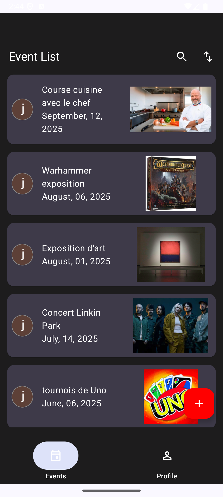
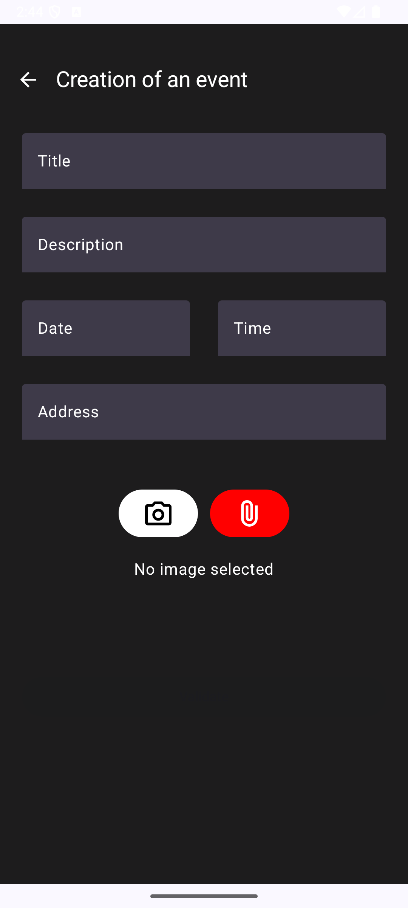

# Eventorias

Application Android de gestion d’événements développée en Kotlin avec Jetpack Compose, Firebase et une architecture MVVM / Clean Architecture, conçue pour être robuste, maintenable et évolutive.

   

---

## Présentation

Eventorias est une application permettant de créer, organiser et gérer des événements via une interface moderne et intuitive.

L’objectif du projet est de concevoir une application Android robuste, maintenable et évolutive, respectant les bonnes pratiques du développement mobile.

---

## Aperçu

<p align="center">
  
  
  
</p>

---

## Fonctionnalités

- Création d’événements  
- Gestion des informations (titre, description, date, lieu)  
- Modification et suppression  
- Authentification utilisateur  
- Synchronisation avec Firebase  
- Accessibilité utilisateur  

---

## Stack technique

- Kotlin  
- Jetpack Compose
- MVVM  
- Clean Architecture  
- Hilt (Dependency Injection)  
- Firebase  
- Retrofit  
- Room (si utilisé)  
- JUnit  

---

## Architecture

L’application suit une architecture MVVM associée à la Clean Architecture.

### Organisation

- View (Jetpack Compose) : interface utilisateur  
- ViewModel : gestion de l’état  
- UseCases : logique métier  
- Repository : abstraction des données  
- Data sources : Firebase / API  

### Principes

- séparation des responsabilités  
- code maintenable et testable  
- transformation des données via des mappers  

---

## Mon rôle

- Conception de l’architecture MVVM et Clean Architecture  
- Développement de l’interface avec Jetpack Compose  
- Intégration de Firebase (authentification et base de données)  
- Implémentation des UseCases et Repository  
- Gestion de l’état via ViewModel  
- Création de composants réutilisables  

---

## Objectif du projet

Ce projet s’inscrit dans ma reconversion en développement Android.

Il m’a permis de :
- maîtriser une architecture moderne  
- structurer une application complète  
- travailler avec Firebase  
- produire un code propre et évolutif  

---

## Difficultés rencontrées

- Intégration Firebase UI (gestion de dépréciations)  
- Gestion du temps de développement  

### Solutions

- Documentation officielle Android  
- Accompagnement OpenClassrooms  
- Recherche technique (GitHub, StackOverflow)  

---

## Lancer le projet

```bash
git clone https://github.com/HRDF88/eventorias.git

```

## Auteur

Julien SEGUIN
Développeur Android – Kotlin & Jetpack Compose 

Email : julien.seguin@hotmail.fr  
GitHub : [HRDF88](https://github.com/HRDF88)

---

Ce projet illustre ma capacité à concevoir une application Android structurée, maintenable et basée sur les bonnes pratiques actuelles.


